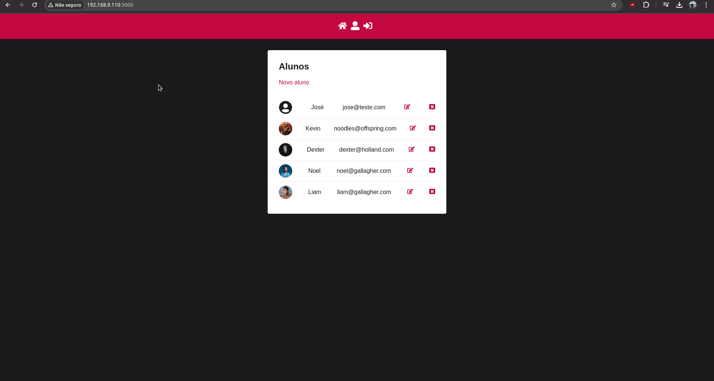

# Projeto de frontend para consumo de API REST

Projeto de frontend para consumo de API REST de uma escola construído no curso de Javascript e TypeScript - front-end e back-end (Full Stack) - Node, Express, noSQL, React, hooks, Redux e Design Patterns.

## Tecnologias praticadas neste projeto

- Git;
- Eslint;
- Prettier;
- Axios;
- History;
- React;
- Redux;
- Redux Saga;
- Styled-Components;
- React Toastify;
- Dotenv;
- DBeaver;
- VirtualBox;
- Firewall
- SSH;
- PM2;
- Nginx.

## Funcionalidades do projeto

- Criação e edição de contas;
- Login e logout do sistema;
- Visualização da lista de alunos;
- Cadastro de novos alunos;
- Edição dos alunos cadastrados;
- Possibilidade de fazer upload de fotos dos alunos.

### Gif do projeto

